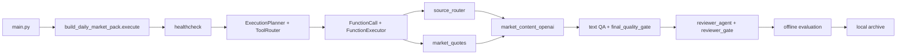

# 每日市场内容包：文字与分析流程

当前运行时只保留文字、结构化行情、新闻来源、内容校验、Reviewer 和离线评测。
外部发布适配器和发布控制保持独立，并由安全门禁阻断。

## 状态步骤

`health_check -> collect_github -> collect_sources -> collect_market_quotes -> generate_content -> final_validation -> build_review_package -> reviewer_agent -> reviewer_gate -> offline_evaluation -> archive`

## 关键产物

- `outputs/.../market_content/market_content.json`
- `outputs/.../market_sources/`
- `runtime/.../plans/` 与 `runtime/.../decisions/`
- `runtime/.../reviews/`
- `logs/.../qa_report.json` 与 `logs/.../run_manifest.json`

所有结果写入本地运行目录；外部发布不再是项目能力。
